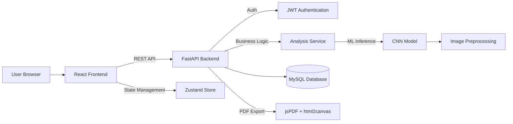

# 🧬 Dermascan AI

  <b>Clinical-grade AI-powered skin cancer detection platform</b> 
  Deep learning diagnostics • Secure medical workflows • Professional reporting

  
  
  
  
  

---

## 🧠 Overview

**Dermascan AI** is a full-stack, AI-powered medical platform designed for the **early detection and classification of skin cancer** using dermatoscopic images.

The system leverages a **Convolutional Neural Network (CNN)** trained on the HAM10000 dataset to classify skin lesions into multiple diagnostic categories, delivering high-confidence predictions in real time.

Beyond raw AI inference, the platform focuses on **clinical usability**, combining secure data handling, structured analysis history, and professional-grade reporting to bridge the gap between **machine learning and real-world healthcare workflows**.

---

## 🏗️ System Architecture

---

## ⚙️ Features

- 🧠 AI-powered skin lesion classification (HAM10000)
- 🔐 Secure authentication (JWT-based)
- 📊 Analysis history & dashboard tracking
- 🧾 Clinical-grade PDF report generation
- 🗑️ Secure deletion of user records
- ⚡ Optimistic UI updates for smooth UX
- 🖥️ Modal-based quick preview of analyses
- 🖨️ Print-optimized medical reports

---

## 🛠️ Tech Stack

### 🎨 Frontend
- React 18
- TypeScript
- Vite
- Zustand
- Tailwind CSS

### ⚙️ Backend
- FastAPI (Python)
- SQLAlchemy
- JWT Authentication
- Bcrypt

### 🤖 Machine Learning
- TensorFlow / Keras (CNN)
- NumPy
- OpenCV / PIL

### 📊 Database
- MySQL

### 📄 Reporting
- jsPDF
- html2canvas

---

## 🚀 Getting Started

### Install Dependencies

pip install -r requirements.txt
npm install

### Run Backend

cd backend
uvicorn main:app --reload

### Run Frontend

cd frontend
npm run dev

---

## 👥 Contributors

- Mohamed Ouijjane  
  https://github.com/MohamedOuijjane  

- Yassine Meskaoui  
  https://github.com/Azepuo

- Moumen Mariam
  https://github.com/MariamMoumen1

---

## 📜 License

MIT License
